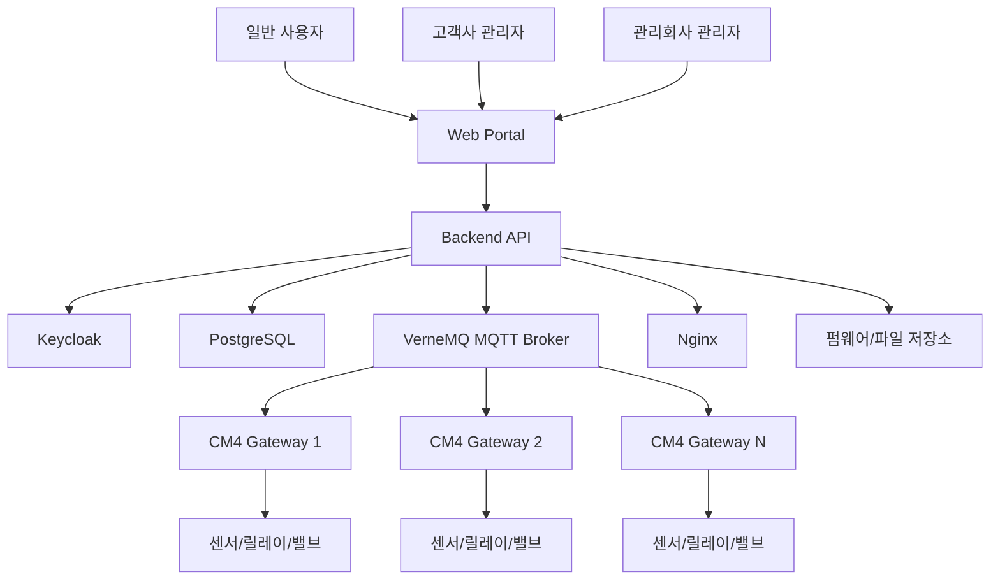
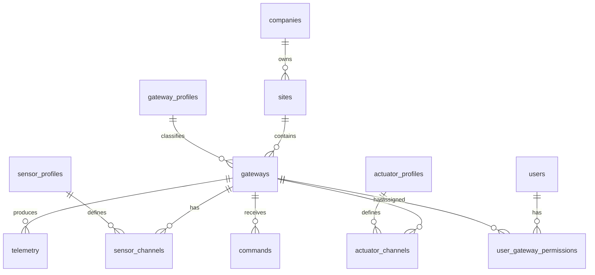
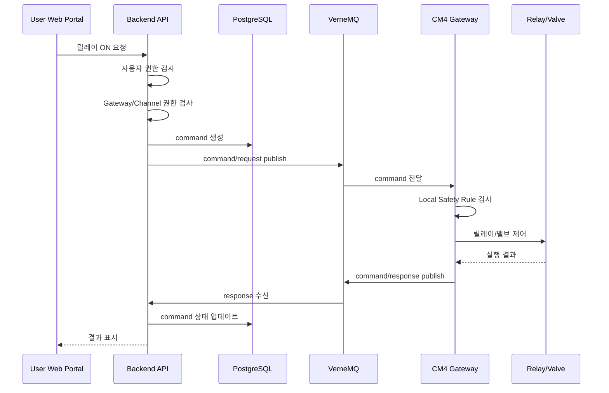

# 산업용 CM4 기반 IoT Gateway 자체 호스팅 상세 구현 계획서

- 작성일: 2026-05-02
- 구축 방식: Docker 미사용, 자체 호스팅, systemd 기반 서비스 운영
- 핵심 구성: VerneMQ + PostgreSQL + Keycloak + 자체 Backend API + 자체 Web Portal
- 핵심 관리 모델: 사용자별 다중 IoT Gateway, Gateway별 상이한 센서 구성, Sensor Profile 기반 동적 관리
- 라이선스 원칙: 무료 오픈소스 중심, 상용화 시 라이선스 리스크 최소화

---

## 1. 프로젝트 개요

본 계획서는 산업용 Raspberry Pi Compute Module 4(CM4) 기반 IoT Gateway 제품을 자체 호스팅 서버와 연동하여 상용화하기 위한 상세 구현 계획서이다.

본 제품은 여러 사용자가 각자 하나 이상의 IoT Gateway를 보유할 수 있고, Gateway마다 서로 다른 종류의 센서와 제어 장치를 연결할 수 있다는 것을 기본 전제로 한다.

따라서 본 시스템은 단순히 고정된 센서 데이터를 수집하는 구조가 아니라, 다음과 같은 기능을 갖춘 **자체 호스팅 IoT Gateway Fleet Management Platform**으로 설계한다.

1. 사용자별 여러 Gateway 관리
2. Gateway별 서로 다른 센서 구성 관리
3. Gateway별 릴레이, 밸브, 펌프 등 제어 채널 관리
4. 센서 종류 추가 시 코드 수정 최소화
5. Gateway 설정 중앙 관리 및 원격 반영
6. 사용자, 고객사, 현장, 장비 단위 권한 관리
7. 원격 제어 명령의 안전성 확보
8. 장비 상태, 센서 데이터, 알람, 제어 이력, 설정 이력 통합 관리
9. Docker 없이 systemd 기반 서버 운영
10. 무료 오픈소스 기반 상용화 가능 구조 유지

---

## 2. 전제 조건

### 2.1 사업 및 운영 전제

| 항목 | 전제 |
|---|---|
| 서비스 운영 방식 | 자체 서버 운영 |
| 퍼블릭 IoT 플랫폼 | AWS IoT, Azure IoT 등 사용하지 않음 |
| 컨테이너 | Docker 사용하지 않음 |
| 서버 운영 | Ubuntu Server LTS + systemd 기반 |
| 사용자 구조 | 한 사용자가 여러 Gateway를 보유 가능 |
| 센서 구성 | Gateway마다 센서 종류와 수량이 다름 |
| 제어 구성 | Gateway마다 릴레이, 밸브, 펌프 등 제어 채널 구성이 다름 |
| 관리회사 | 전체 사용자와 전체 Gateway를 관리 가능 |
| 일반 사용자 | 본인에게 할당된 Gateway만 조회 또는 제어 |
| 라이선스 | 무료 오픈소스 중심, AGPL/BSL/GPL 리스크 최소화 |

### 2.2 기술 전제

| 계층 | 기술 |
|---|---|
| MQTT Broker | VerneMQ |
| DB | PostgreSQL |
| 인증 | Keycloak |
| Backend | FastAPI, Spring Boot, NestJS 중 선택 |
| Frontend | React 또는 Next.js |
| Chart | Apache ECharts |
| Reverse Proxy | Nginx |
| 서비스 관리 | systemd |
| Gateway OS | Raspberry Pi OS Lite 64-bit, Ubuntu Server for ARM64, 또는 Yocto |
| Gateway Local DB | SQLite |
| Gateway 통신 | MQTT over TLS |
| Gateway 설정 | 서버 기반 desired/reported config 구조 |

---

## 3. 핵심 설계 철학

### 3.1 사용자 중심이 아니라 Gateway 중심으로 관리

한 명의 사용자가 여러 Gateway를 가질 수 있고, 하나의 Gateway가 특정 회사 또는 특정 현장에 배정될 수 있으므로 Gateway를 중심 엔티티로 설계해야 한다.

```text
User
  ├─ Gateway 1
  ├─ Gateway 2
  └─ Gateway 3

Company
  └─ Site
       ├─ Gateway A
       ├─ Gateway B
       └─ Gateway C
```

실제 권한 판단은 다음 세 가지 축을 함께 사용한다.

```text
User 권한
Company 권한
Gateway 권한
```

---

### 3.2 센서 종류는 코드가 아니라 Profile로 관리

센서가 늘어날 때마다 Backend DB schema나 Gateway 코드를 수정하면 유지보수가 어렵다. 따라서 센서 모델 정보를 `Sensor Profile`로 관리하고, 실제 Gateway에 연결된 센서는 `Sensor Channel`로 관리한다.

```text
Sensor Profile
  ├─ 센서 모델 정보
  ├─ 통신 프로토콜
  ├─ 측정 항목
  ├─ 단위
  ├─ scale
  ├─ offset
  ├─ register map
  └─ visualization hint

Sensor Channel
  ├─ 특정 Gateway에 연결된 실제 센서
  ├─ 어떤 Sensor Profile을 사용하는지
  ├─ 어떤 포트에 연결되었는지
  ├─ slave_id/address
  ├─ polling interval
  └─ enabled 여부
```

---

### 3.3 Gateway 설정은 중앙에서 버전 관리

Gateway마다 센서 구성이 다르므로, Gateway 내부 프로그램은 고정 설정으로 동작하면 안 된다. 서버가 Gateway별 설정을 관리하고, Gateway는 해당 설정을 받아 동적으로 센서 수집 및 제어 구성을 적용해야 한다.

```text
Web Portal에서 설정 변경
  → Backend DB 저장
  → Gateway Config 생성
  → Config Version 증가
  → MQTT/HTTPS로 Gateway에 전달
  → Gateway 설정 적용
  → reported_config 보고
```

---

### 3.4 Docker 대신 systemd 기반 서비스 운영

Docker를 사용하지 않으므로 서버 구성요소는 OS 서비스로 등록하여 운영한다.

```text
nginx.service
vernemq.service
postgresql.service
keycloak.service
iot-backend.service
iot-worker.service
iot-scheduler.service
```

---

## 4. 전체 시스템 아키텍처



---

## 5. 서버 구성

### 5.1 서버 구성요소

```text
Ubuntu Server LTS
  ├─ Nginx
  ├─ VerneMQ
  ├─ PostgreSQL
  ├─ Keycloak
  ├─ Backend API
  ├─ Worker Service
  ├─ Scheduler Service
  ├─ Web Portal
  ├─ File/Firmware Storage
  └─ Backup Scripts
```

### 5.2 systemd 서비스 구성

| 서비스 | 역할 |
|---|---|
| nginx.service | HTTPS reverse proxy, frontend 정적 파일 제공 |
| vernemq.service | MQTT Broker |
| postgresql.service | 관계형 DB 및 센서 데이터 저장 |
| keycloak.service | 사용자 인증, OIDC/OAuth2 토큰 발급 |
| iot-backend.service | REST API, 권한 검사, Gateway 관리, 명령 발행 |
| iot-worker.service | MQTT 수신 처리, telemetry ingestion, alarm evaluation |
| iot-scheduler.service | 주기 작업, offline 판단, report 생성 |
| prometheus.service | 선택 사항, 내부 metric 수집 |
| opensearch.service | 선택 사항, 로그 검색 |

---

## 6. 권장 서버 디렉터리 구조

```text
/opt/iot-platform/
  ├─ backend/
  │   ├─ app/
  │   ├─ venv/
  │   ├─ migrations/
  │   └─ scripts/
  │
  ├─ worker/
  │   ├─ app/
  │   └─ venv/
  │
  ├─ scheduler/
  │   ├─ app/
  │   └─ venv/
  │
  ├─ frontend/
  │   ├─ current/
  │   └─ releases/
  │
  ├─ releases/
  │   ├─ backend-1.0.0/
  │   ├─ backend-1.0.1/
  │   └─ backend-1.0.2/
  │
  └─ current -> /opt/iot-platform/releases/backend-1.0.2

/etc/iot-platform/
  ├─ backend.env
  ├─ worker.env
  ├─ scheduler.env
  ├─ mqtt.env
  ├─ db.env
  └─ keycloak.env

/var/lib/iot-platform/
  ├─ firmware/
  ├─ gateway-configs/
  ├─ reports/
  ├─ log-bundles/
  └─ backups/

/var/log/iot-platform/
  ├─ backend.log
  ├─ worker.log
  ├─ scheduler.log
  └─ mqtt-ingestion.log
```

---

## 7. Backend 구성

### 7.1 Backend 주요 역할

Backend API는 단순 CRUD 서버가 아니라 IoT 플랫폼의 중앙 제어 계층이다.

```text
Backend API
  ├─ 사용자 인증 연동
  ├─ 사용자/회사/현장/장비 권한 검사
  ├─ Gateway 등록 및 소유권 관리
  ├─ Gateway Profile 관리
  ├─ Sensor Profile 관리
  ├─ Sensor Channel 관리
  ├─ Actuator Profile 관리
  ├─ Actuator Channel 관리
  ├─ Gateway Config 생성 및 버전 관리
  ├─ MQTT command publish
  ├─ Telemetry 조회 API
  ├─ Latest telemetry 조회
  ├─ Alarm Rule 관리
  ├─ Audit Log 저장
  ├─ OTA job 관리
  └─ 관리자용 통계 API
```

### 7.2 Worker 주요 역할

Worker는 MQTT Broker와 연동하여 장비에서 올라오는 데이터를 처리한다.

```text
Worker Service
  ├─ MQTT subscribe
  ├─ telemetry message 검증
  ├─ telemetry 저장
  ├─ telemetry_latest upsert
  ├─ gateway heartbeat 처리
  ├─ command response 처리
  ├─ reported_config 처리
  ├─ alarm evaluation
  └─ event log 저장
```

### 7.3 Scheduler 주요 역할

Scheduler는 주기적으로 상태를 점검한다.

```text
Scheduler Service
  ├─ Gateway offline 판단
  ├─ 미응답 command timeout 처리
  ├─ 오래된 telemetry partition 정리
  ├─ 백업 실행
  ├─ OTA job 상태 확인
  ├─ 알람 재전송
  └─ 통계/리포트 생성
```

---

## 8. 사용자 및 권한 모델

### 8.1 권한 계층

```text
System Admin
  └─ Management Company Admin
       └─ Customer Company Admin
            └─ Site Manager
                 └─ Operator
                      └─ Viewer
```

### 8.2 권한 범위

| 역할 | 권한 |
|---|---|
| System Admin | 시스템 전체 설정, 모든 회사와 Gateway 관리 |
| Management Company Admin | 모든 고객사와 전체 Gateway 관제 및 유지보수 |
| Customer Company Admin | 본인 회사 소속 사용자, 현장, Gateway 관리 |
| Site Manager | 특정 현장 Gateway 관리 |
| Operator | 허용된 Gateway의 제어 채널 조작 |
| Viewer | 센서 데이터와 상태 조회만 가능 |
| Maintenance Engineer | 진단, 로그 수집, OTA, 재부팅 가능 |

### 8.3 권한 구조

사용자가 여러 Gateway를 가질 수 있으므로 다음 권한 테이블을 둔다.

```text
user_company_roles
user_site_permissions
user_gateway_permissions
```

권한 예시:

```text
view
control
configure
maintain
admin
```

---

## 9. Keycloak 구성

### 9.1 Realm

```text
Realm: iot-platform
```

### 9.2 Groups

```text
management-company
customer-company-a
customer-company-b
customer-company-c
```

### 9.3 Roles

```text
system_admin
management_admin
company_admin
site_manager
operator
viewer
maintenance_engineer
```

### 9.4 설계 원칙

Keycloak은 인증, 로그인, 토큰 발급을 담당한다. 실제 Gateway 접근권한은 Backend DB에서 판단한다.

```text
Keycloak
  └─ 사용자 인증 및 role claim 제공

Backend
  └─ company_id, site_id, gateway_id 기반 실제 권한 판단
```

---

## 10. PostgreSQL 데이터 모델

### 10.1 핵심 엔티티 관계



---

## 11. DB 테이블 설계

### 11.1 companies

```sql
CREATE TABLE companies (
    id UUID PRIMARY KEY,
    name TEXT NOT NULL,
    company_type TEXT NOT NULL, -- management, customer
    status TEXT NOT NULL DEFAULT 'active',
    created_at TIMESTAMPTZ DEFAULT now(),
    updated_at TIMESTAMPTZ DEFAULT now()
);
```

### 11.2 sites

```sql
CREATE TABLE sites (
    id UUID PRIMARY KEY,
    company_id UUID NOT NULL REFERENCES companies(id),
    name TEXT NOT NULL,
    address TEXT,
    latitude DOUBLE PRECISION,
    longitude DOUBLE PRECISION,
    created_at TIMESTAMPTZ DEFAULT now(),
    updated_at TIMESTAMPTZ DEFAULT now()
);
```

### 11.3 users

```sql
CREATE TABLE users (
    id UUID PRIMARY KEY,
    keycloak_user_id TEXT UNIQUE NOT NULL,
    email TEXT UNIQUE NOT NULL,
    name TEXT NOT NULL,
    status TEXT NOT NULL DEFAULT 'active',
    created_at TIMESTAMPTZ DEFAULT now(),
    updated_at TIMESTAMPTZ DEFAULT now()
);
```

### 11.4 user_company_roles

```sql
CREATE TABLE user_company_roles (
    id UUID PRIMARY KEY,
    user_id UUID NOT NULL REFERENCES users(id),
    company_id UUID NOT NULL REFERENCES companies(id),
    role TEXT NOT NULL,
    created_at TIMESTAMPTZ DEFAULT now(),
    UNIQUE(user_id, company_id, role)
);
```

### 11.5 user_gateway_permissions

```sql
CREATE TABLE user_gateway_permissions (
    id UUID PRIMARY KEY,
    user_id UUID NOT NULL REFERENCES users(id),
    gateway_id UUID NOT NULL,
    permission TEXT NOT NULL,
    created_at TIMESTAMPTZ DEFAULT now(),
    UNIQUE(user_id, gateway_id, permission)
);
```

---

## 12. Gateway Profile 설계

Gateway 하드웨어 모델별 지원 인터페이스와 출력 채널을 정의한다.

### 12.1 gateway_profiles

```sql
CREATE TABLE gateway_profiles (
    id UUID PRIMARY KEY,
    name TEXT NOT NULL,
    model TEXT NOT NULL,
    hardware_schema JSONB NOT NULL,
    description TEXT,
    created_at TIMESTAMPTZ DEFAULT now(),
    updated_at TIMESTAMPTZ DEFAULT now()
);
```

### 12.2 Gateway Profile 예시

```json
{
  "model": "CM4-GW-RS485-RELAY-8",
  "interfaces": [
    {
      "name": "rs485_1",
      "type": "rs485",
      "supported_protocols": ["modbus_rtu"],
      "baudrates": [9600, 19200, 38400, 115200]
    },
    {
      "name": "rs485_2",
      "type": "rs485",
      "supported_protocols": ["modbus_rtu"],
      "baudrates": [9600, 19200, 38400, 115200]
    },
    {
      "name": "di_1",
      "type": "digital_input"
    },
    {
      "name": "ai_1",
      "type": "analog_input",
      "input_types": ["0-10V", "4-20mA"]
    }
  ],
  "actuators": [
    {
      "name": "relay_1",
      "type": "relay",
      "gpio": 17,
      "default_state": "off"
    },
    {
      "name": "relay_2",
      "type": "relay",
      "gpio": 18,
      "default_state": "off"
    }
  ]
}
```

---

## 13. Gateway Instance 설계

### 13.1 gateways

```sql
CREATE TABLE gateways (
    id UUID PRIMARY KEY,
    serial_number TEXT UNIQUE NOT NULL,
    name TEXT NOT NULL,
    company_id UUID NOT NULL REFERENCES companies(id),
    site_id UUID REFERENCES sites(id),
    gateway_profile_id UUID REFERENCES gateway_profiles(id),
    status TEXT NOT NULL DEFAULT 'offline',
    firmware_version TEXT,
    app_version TEXT,
    config_version INTEGER DEFAULT 0,
    last_seen_at TIMESTAMPTZ,
    registered_at TIMESTAMPTZ DEFAULT now(),
    created_at TIMESTAMPTZ DEFAULT now(),
    updated_at TIMESTAMPTZ DEFAULT now()
);
```

### 13.2 Gateway 등록 시나리오

```text
1. 제조 시 serial_number 발급
2. 서버에 Gateway 사전 등록
3. Gateway 인증 정보 생성
4. 관리자가 Gateway를 특정 회사/현장에 할당
5. Gateway Profile 지정
6. Sensor Channel 구성
7. Actuator Channel 구성
8. Gateway Config 생성
9. Gateway가 서버 연결 후 설정 다운로드
```

---

## 14. Sensor Profile 설계

### 14.1 sensor_profiles

```sql
CREATE TABLE sensor_profiles (
    id UUID PRIMARY KEY,
    name TEXT NOT NULL,
    vendor TEXT,
    model TEXT,
    protocol TEXT NOT NULL,
    description TEXT,
    profile_schema JSONB NOT NULL,
    enabled BOOLEAN DEFAULT true,
    created_at TIMESTAMPTZ DEFAULT now(),
    updated_at TIMESTAMPTZ DEFAULT now()
);
```

### 14.2 온습도 센서 Profile 예시

```json
{
  "name": "RS485 Temperature Humidity Sensor",
  "vendor": "Generic",
  "model": "TH-RS485-01",
  "protocol": "modbus_rtu",
  "interface_type": "rs485",
  "default_polling_interval_sec": 10,
  "connection": {
    "baudrate": 9600,
    "parity": "none",
    "data_bits": 8,
    "stop_bits": 1
  },
  "measurements": [
    {
      "key": "temperature",
      "display_name": "Temperature",
      "unit": "degC",
      "data_type": "float",
      "modbus": {
        "function_code": 3,
        "register": 0,
        "length": 1
      },
      "scale": 0.1,
      "offset": 0,
      "min": -40,
      "max": 85,
      "visualization": "line_chart"
    },
    {
      "key": "humidity",
      "display_name": "Humidity",
      "unit": "%",
      "data_type": "float",
      "modbus": {
        "function_code": 3,
        "register": 1,
        "length": 1
      },
      "scale": 0.1,
      "offset": 0,
      "min": 0,
      "max": 100,
      "visualization": "line_chart"
    }
  ]
}
```

### 14.3 기울기 센서 Profile 예시

```json
{
  "name": "RS485 2-Axis Tilt Sensor",
  "vendor": "Generic",
  "model": "TILT-RS485-02",
  "protocol": "modbus_rtu",
  "interface_type": "rs485",
  "default_polling_interval_sec": 5,
  "measurements": [
    {
      "key": "tilt_x",
      "display_name": "Tilt X",
      "unit": "degree",
      "data_type": "float",
      "modbus": {
        "function_code": 3,
        "register": 0,
        "length": 1
      },
      "scale": 0.01,
      "offset": 0,
      "visualization": "line_chart"
    },
    {
      "key": "tilt_y",
      "display_name": "Tilt Y",
      "unit": "degree",
      "data_type": "float",
      "modbus": {
        "function_code": 3,
        "register": 1,
        "length": 1
      },
      "scale": 0.01,
      "offset": 0,
      "visualization": "line_chart"
    }
  ]
}
```

---

## 15. Sensor Channel 설계

Sensor Channel은 특정 Gateway에 실제로 연결된 센서 인스턴스를 의미한다.

### 15.1 sensor_channels

```sql
CREATE TABLE sensor_channels (
    id UUID PRIMARY KEY,
    gateway_id UUID NOT NULL REFERENCES gateways(id),
    sensor_profile_id UUID NOT NULL REFERENCES sensor_profiles(id),
    display_name TEXT NOT NULL,
    interface_name TEXT NOT NULL,
    protocol TEXT NOT NULL,
    address TEXT,
    slave_id INTEGER,
    polling_interval_sec INTEGER DEFAULT 10,
    enabled BOOLEAN DEFAULT true,
    config JSONB,
    created_at TIMESTAMPTZ DEFAULT now(),
    updated_at TIMESTAMPTZ DEFAULT now()
);
```

### 15.2 Sensor Channel 예시

```json
{
  "gateway_id": "GW-000001",
  "sensor_channel_id": "sensor-01",
  "sensor_profile_id": "profile-rs485-temp-humi-001",
  "display_name": "1번 온습도 센서",
  "interface": "rs485_1",
  "protocol": "modbus_rtu",
  "slave_id": 1,
  "polling_interval_sec": 10,
  "enabled": true
}
```

---

## 16. Actuator Profile 및 Channel 설계

### 16.1 actuator_profiles

```sql
CREATE TABLE actuator_profiles (
    id UUID PRIMARY KEY,
    name TEXT NOT NULL,
    actuator_type TEXT NOT NULL, -- relay, valve, pump, ssr
    profile_schema JSONB NOT NULL,
    created_at TIMESTAMPTZ DEFAULT now(),
    updated_at TIMESTAMPTZ DEFAULT now()
);
```

### 16.2 actuator_channels

```sql
CREATE TABLE actuator_channels (
    id UUID PRIMARY KEY,
    gateway_id UUID NOT NULL REFERENCES gateways(id),
    actuator_profile_id UUID REFERENCES actuator_profiles(id),
    display_name TEXT NOT NULL,
    actuator_type TEXT NOT NULL,
    hardware_channel TEXT NOT NULL,
    default_state TEXT NOT NULL DEFAULT 'off',
    current_state TEXT,
    enabled BOOLEAN DEFAULT true,
    safety_config JSONB,
    created_at TIMESTAMPTZ DEFAULT now(),
    updated_at TIMESTAMPTZ DEFAULT now()
);
```

### 16.3 Actuator Channel 예시

```json
{
  "gateway_id": "GW-000001",
  "actuator_channel_id": "relay-01",
  "display_name": "급수 밸브",
  "actuator_type": "relay",
  "hardware_channel": "relay_1",
  "default_state": "off",
  "safety_config": {
    "max_on_duration_sec": 300,
    "manual_override_allowed": true,
    "fail_safe_state": "off"
  }
}
```

---

## 17. Telemetry 설계

센서 종류가 다양하므로 telemetry는 고정 컬럼이 아니라 `measurement_key` 기반으로 저장한다.

### 17.1 telemetry

```sql
CREATE TABLE telemetry (
    id BIGSERIAL,
    company_id UUID NOT NULL,
    site_id UUID,
    gateway_id UUID NOT NULL REFERENCES gateways(id),
    sensor_channel_id UUID NOT NULL REFERENCES sensor_channels(id),
    measurement_key TEXT NOT NULL,
    ts TIMESTAMPTZ NOT NULL,
    value_double DOUBLE PRECISION,
    value_text TEXT,
    value_bool BOOLEAN,
    value_json JSONB,
    unit TEXT,
    quality TEXT,
    raw JSONB,
    PRIMARY KEY (id, ts)
) PARTITION BY RANGE (ts);
```

### 17.2 월별 Partition 예시

```sql
CREATE TABLE telemetry_2026_05 PARTITION OF telemetry
FOR VALUES FROM ('2026-05-01') TO ('2026-06-01');
```

### 17.3 telemetry_latest

대시보드 최신값 조회 성능을 위해 별도 테이블을 둔다.

```sql
CREATE TABLE telemetry_latest (
    gateway_id UUID NOT NULL,
    sensor_channel_id UUID NOT NULL,
    measurement_key TEXT NOT NULL,
    ts TIMESTAMPTZ NOT NULL,
    value_double DOUBLE PRECISION,
    value_text TEXT,
    value_bool BOOLEAN,
    value_json JSONB,
    unit TEXT,
    quality TEXT,
    PRIMARY KEY (gateway_id, sensor_channel_id, measurement_key)
);
```

### 17.4 telemetry 예시

| gateway_id | sensor_channel_id | measurement_key | value_double | unit |
|---|---|---|---:|---|
| GW-001 | sensor-01 | temperature | 24.7 | degC |
| GW-001 | sensor-01 | humidity | 61.2 | % |
| GW-002 | sensor-01 | pm2_5 | 18.3 | ug/m3 |
| GW-002 | sensor-02 | tilt_x | 3.2 | degree |

---

## 18. Gateway Config 설계

### 18.1 gateway_configs

```sql
CREATE TABLE gateway_configs (
    id UUID PRIMARY KEY,
    gateway_id UUID NOT NULL REFERENCES gateways(id),
    config_version INTEGER NOT NULL,
    config_hash TEXT NOT NULL,
    desired_config JSONB NOT NULL,
    status TEXT NOT NULL DEFAULT 'pending',
    created_by UUID REFERENCES users(id),
    created_at TIMESTAMPTZ DEFAULT now(),
    applied_at TIMESTAMPTZ,
    UNIQUE(gateway_id, config_version)
);
```

### 18.2 gateway_config_history

```sql
CREATE TABLE gateway_config_history (
    id UUID PRIMARY KEY,
    gateway_id UUID NOT NULL REFERENCES gateways(id),
    config_version INTEGER NOT NULL,
    config_snapshot JSONB NOT NULL,
    change_reason TEXT,
    changed_by UUID REFERENCES users(id),
    changed_at TIMESTAMPTZ DEFAULT now()
);
```

### 18.3 Gateway desired_config 예시

```json
{
  "gateway_id": "GW-000001",
  "config_version": 12,
  "config_hash": "a83f2e9d",
  "interfaces": [
    {
      "name": "rs485_1",
      "type": "rs485",
      "baudrate": 9600,
      "parity": "none",
      "data_bits": 8,
      "stop_bits": 1
    }
  ],
  "sensors": [
    {
      "sensor_channel_id": "sensor-01",
      "profile_id": "profile-rs485-temp-humi-001",
      "display_name": "1번 온습도 센서",
      "interface": "rs485_1",
      "protocol": "modbus_rtu",
      "slave_id": 1,
      "polling_interval_sec": 10
    }
  ],
  "actuators": [
    {
      "actuator_channel_id": "relay-01",
      "display_name": "급수 밸브",
      "type": "relay",
      "hardware_channel": "relay_1",
      "default_state": "off",
      "max_on_duration_sec": 300
    }
  ],
  "rules": [
    {
      "rule_id": "rule-001",
      "type": "safety",
      "if": {
        "sensor_channel_id": "sensor-01",
        "measurement_key": "temperature",
        "condition": ">",
        "threshold": 40
      },
      "then": {
        "actuator_channel_id": "relay-01",
        "action": "OFF"
      }
    }
  ]
}
```

### 18.4 Gateway reported_config 예시

```json
{
  "gateway_id": "GW-000001",
  "applied_config_version": 12,
  "config_hash": "a83f2e9d",
  "status": "applied",
  "applied_at": "2026-05-02T12:00:00Z",
  "errors": []
}
```

---

## 19. MQTT Topic 설계

### 19.1 기본 원칙

MQTT topic은 사용자 기준이 아니라 Gateway 기준으로 설계한다.

비추천:

```text
user/{userId}/gateway/{gatewayId}/telemetry
```

추천:

```text
gw/{gatewayId}/telemetry
```

사용자와 Gateway의 관계는 Backend DB에서 관리한다.

### 19.2 권장 topic

```text
gw/{gatewayId}/telemetry
gw/{gatewayId}/state
gw/{gatewayId}/heartbeat
gw/{gatewayId}/event

gw/{gatewayId}/config/desired
gw/{gatewayId}/config/reported

gw/{gatewayId}/command/request
gw/{gatewayId}/command/response

gw/{gatewayId}/ota/request
gw/{gatewayId}/ota/status

gw/{gatewayId}/log/upload
```

### 19.3 Gateway publish 권한

```text
gw/{gatewayId}/telemetry
gw/{gatewayId}/state
gw/{gatewayId}/heartbeat
gw/{gatewayId}/event
gw/{gatewayId}/config/reported
gw/{gatewayId}/command/response
gw/{gatewayId}/ota/status
```

### 19.4 Gateway subscribe 권한

```text
gw/{gatewayId}/config/desired
gw/{gatewayId}/command/request
gw/{gatewayId}/ota/request
```

---

## 20. MQTT Payload 설계

### 20.1 Telemetry Payload

```json
{
  "message_id": "msg-20260502-000001",
  "gateway_id": "GW-000001",
  "timestamp": "2026-05-02T12:00:00Z",
  "values": [
    {
      "sensor_channel_id": "sensor-01",
      "measurement_key": "temperature",
      "value": 24.7,
      "unit": "degC",
      "quality": "good"
    },
    {
      "sensor_channel_id": "sensor-01",
      "measurement_key": "humidity",
      "value": 61.2,
      "unit": "%",
      "quality": "good"
    }
  ]
}
```

### 20.2 Gateway State Payload

```json
{
  "gateway_id": "GW-000001",
  "timestamp": "2026-05-02T12:00:00Z",
  "status": "online",
  "app_version": "1.0.3",
  "firmware_version": "2026.05.02",
  "config_version": 12,
  "uptime_sec": 82344,
  "cpu_temp": 51.3,
  "memory_usage_percent": 38.7,
  "disk_usage_percent": 42.1,
  "network": {
    "ethernet": true,
    "ip": "192.168.0.25",
    "rtt_ms": 34
  }
}
```

---

## 21. 원격 제어 명령 설계

### 21.1 명령 처리 흐름



### 21.2 Command Request

```json
{
  "command_id": "cmd-20260502-000001",
  "gateway_id": "GW-000001",
  "target_type": "actuator",
  "target_id": "relay-01",
  "action": "ON",
  "issued_by": "user-123",
  "issued_at": "2026-05-02T12:04:00Z",
  "expires_at": "2026-05-02T12:05:00Z",
  "timeout_ms": 3000,
  "require_ack": true,
  "reason": "manual_control"
}
```

### 21.3 Command Response

```json
{
  "command_id": "cmd-20260502-000001",
  "gateway_id": "GW-000001",
  "status": "executed",
  "result": "relay-01-on",
  "executed_at": "2026-05-02T12:04:15Z",
  "local_safety_check": "passed"
}
```

### 21.4 명령 안전 조건

| 조건 | 설명 |
|---|---|
| command_id | 중복 실행 방지 |
| expires_at | 오래된 명령 폐기 |
| timeout_ms | 지연 명령 실패 처리 |
| require_ack | 실행 결과 필수 확인 |
| local_safety_check | 현장 조건 확인 후 실행 |
| audit_log | 사용자, 시간, 대상, 결과 저장 |
| fail_safe | 장애 시 안전 상태로 전환 |
| manual_override | 현장 수동 제어 우선 |

---

## 22. 알람 및 자동 제어 Rule 설계

### 22.1 alarm_rules

```sql
CREATE TABLE alarm_rules (
    id UUID PRIMARY KEY,
    gateway_id UUID NOT NULL REFERENCES gateways(id),
    sensor_channel_id UUID NOT NULL REFERENCES sensor_channels(id),
    measurement_key TEXT NOT NULL,
    condition TEXT NOT NULL,
    threshold DOUBLE PRECISION,
    duration_sec INTEGER DEFAULT 0,
    severity TEXT NOT NULL,
    enabled BOOLEAN DEFAULT true,
    created_at TIMESTAMPTZ DEFAULT now()
);
```

### 22.2 Alarm Rule 예시

```json
{
  "gateway_id": "GW-000001",
  "sensor_channel_id": "sensor-01",
  "measurement_key": "temperature",
  "condition": ">",
  "threshold": 35.0,
  "duration_sec": 60,
  "severity": "warning",
  "action": "notify"
}
```

### 22.3 제어 Rule 예시

```json
{
  "gateway_id": "GW-000001",
  "rule_id": "control-rule-001",
  "if": {
    "sensor_channel_id": "sensor-02",
    "measurement_key": "water_level",
    "condition": "<",
    "threshold": 20
  },
  "then": {
    "actuator_channel_id": "relay-01",
    "action": "ON"
  },
  "safety": {
    "max_on_duration_sec": 300
  }
}
```

자동 제어 Rule은 서버에만 있으면 안 된다. 통신 장애 시에도 동작해야 하므로 Gateway 로컬 Rule Engine에도 배포해야 한다.

---

## 23. Web Portal 상세 설계

### 23.1 일반 사용자 화면

```text
내 Gateway 목록
  ├─ Gateway 이름
  ├─ 설치 위치
  ├─ Online/Offline 상태
  ├─ 알람 상태
  ├─ 주요 센서 최신값
  ├─ 제어 가능한 릴레이/밸브
  └─ 최근 이벤트
```

### 23.2 Gateway 상세 화면

```text
Gateway 상세
  ├─ 기본 정보
  ├─ 네트워크 상태
  ├─ 센서 채널 목록
  ├─ 최신 센서값
  ├─ 시계열 그래프
  ├─ 제어 채널
  ├─ 알람 이력
  ├─ 명령 이력
  ├─ 설정 버전
  └─ 유지보수 로그
```

### 23.3 관리자 화면

```text
관리자 화면
  ├─ 사용자 관리
  ├─ 고객사 관리
  ├─ 현장 관리
  ├─ Gateway 등록
  ├─ Gateway 소유권 할당
  ├─ Gateway Profile 관리
  ├─ Sensor Profile 관리
  ├─ Sensor Channel 설정
  ├─ Actuator Channel 설정
  ├─ Gateway Template 관리
  ├─ Bulk Operation
  ├─ OTA 관리
  └─ Audit Log 조회
```

---

## 24. Sensor 추가 Wizard 설계

센서 구성이 다양하므로 관리자 UI에는 Wizard가 필요하다.

```text
센서 추가 Wizard

1단계: Gateway 선택
2단계: 인터페이스 선택
       - RS-485 #1
       - RS-485 #2
       - Analog Input #1
       - Digital Input #1
       - I2C
       - UART

3단계: 센서 Profile 선택
       - 온습도 센서
       - 미세먼지 센서
       - 기울기 센서
       - 수위 센서
       - 압력 센서
       - 유량 센서
       - pH 센서
       - DO 센서

4단계: 통신 설정
       - Modbus Slave ID
       - Baudrate
       - Parity
       - Stop bit

5단계: 측정 주기 설정

6단계: 표시 이름 설정

7단계: 저장

8단계: Gateway Config 생성 및 배포
```

---

## 25. Dashboard 자동 생성

Gateway마다 센서 구성이 다르므로 대시보드는 동적으로 생성한다.

### 25.1 자동 Widget 매핑

| measurement_key | Widget |
|---|---|
| temperature | Line Chart, Current Value Card |
| humidity | Line Chart, Gauge |
| pressure | Line Chart |
| pm2_5 | Gauge, Line Chart |
| tilt_x, tilt_y | 2-axis Tilt View, Line Chart |
| water_level | Gauge |
| relay_state | Toggle, Status Card |
| valve_state | Toggle, Status Card |
| gps | Map |

### 25.2 Sensor Profile의 visualization 설정

```json
{
  "key": "temperature",
  "display_name": "Temperature",
  "unit": "degC",
  "visualization": "line_chart",
  "display_group": "environment",
  "order": 1
}
```

---

## 26. Gateway Template 설계

자주 쓰는 Gateway 구성을 템플릿으로 저장한다.

### 26.1 예시: 양식장 기본형

```text
양식장 기본형 Template
  ├─ 수온 센서
  ├─ pH 센서
  ├─ DO 센서
  ├─ 수위 센서
  ├─ 산소 공급 릴레이
  └─ 급수 펌프 릴레이
```

### 26.2 예시: 어선 안전형

```text
어선 안전형 Template
  ├─ 기울기 센서
  ├─ 침수 센서
  ├─ 온습도 센서
  ├─ GPS
  ├─ 경보 릴레이
  └─ 비상 알림 출력
```

### 26.3 gateway_templates

```sql
CREATE TABLE gateway_templates (
    id UUID PRIMARY KEY,
    name TEXT NOT NULL,
    description TEXT,
    gateway_profile_id UUID REFERENCES gateway_profiles(id),
    template_schema JSONB NOT NULL,
    created_at TIMESTAMPTZ DEFAULT now()
);
```

---

## 27. Bulk Operation 설계

Gateway 수가 증가하면 일괄 작업이 필수이다.

### 27.1 지원해야 할 일괄 작업

```text
일괄 Gateway 현장 배정
일괄 사용자 권한 부여
일괄 센서 polling 주기 변경
일괄 알람 기준 변경
일괄 OTA 업데이트
일괄 Gateway 재시작
일괄 설정 배포
일괄 로그 수집
```

### 27.2 bulk_jobs

```sql
CREATE TABLE bulk_jobs (
    id UUID PRIMARY KEY,
    job_type TEXT NOT NULL,
    target_filter JSONB NOT NULL,
    payload JSONB NOT NULL,
    status TEXT NOT NULL DEFAULT 'pending',
    created_by UUID REFERENCES users(id),
    created_at TIMESTAMPTZ DEFAULT now(),
    completed_at TIMESTAMPTZ
);
```

---

## 28. Gateway Agent 구현 계획

### 28.1 Gateway 내부 구성

```text
/opt/iot-gateway/
  ├─ gateway-agent/
  ├─ sensor-service/
  ├─ actuator-service/
  ├─ rule-engine/
  ├─ mqtt-client/
  ├─ local-db/
  ├─ ota-agent/
  ├─ health-agent/
  ├─ config/
  └─ logs/
```

### 28.2 Gateway Agent 부팅 흐름

```text
1. Gateway ID 확인
2. 인증서 및 설정 파일 확인
3. 네트워크 확인
4. MQTT Broker 연결
5. 현재 config_version 보고
6. 서버 desired_config 확인
7. 설정 버전이 다르면 다운로드
8. 설정 유효성 검사
9. Sensor driver 구성
10. Actuator driver 구성
11. Rule engine 구성
12. reported_config 전송
13. 센서 polling 시작
14. 주기적 heartbeat 전송
```

### 28.3 Gateway Local DB

SQLite를 사용한다.

```text
local_telemetry_queue
local_command_log
local_event_log
local_config
local_alarm_history
```

### 28.4 Local Buffer 정책

| 항목 | 정책 |
|---|---|
| 저장 대상 | telemetry, event, command response |
| 재전송 순서 | timestamp 순서 |
| 중복 방지 | message_id 기반 |
| 보존 기간 | 7~30일 |
| 저장공간 초과 | 오래된 telemetry부터 삭제 |
| 우선순위 | event > command_response > telemetry |

---

## 29. Gateway Safety 설계

제어 장치가 포함되므로 반드시 Gateway 내부 안전 로직이 필요하다.

### 29.1 필수 안전 기능

| 기능 | 설명 |
|---|---|
| Fail-safe state | 장애 시 릴레이/밸브 기본 안전 상태 |
| Max ON duration | 특정 릴레이가 너무 오래 켜져 있지 않도록 제한 |
| Command expiry | 오래된 명령 실행 금지 |
| Manual override | 현장 수동 제어 우선 |
| Interlock | 센서 조건 위반 시 제어 차단 |
| Watchdog | 프로세스 또는 OS 장애 감지 |
| Output feedback | 실제 릴레이 상태 피드백 |
| Emergency stop | 물리적 비상 정지 |

### 29.2 CM4 + Safety MCU 권장

```text
CM4 Linux Gateway
  ├─ 클라우드 통신
  ├─ MQTT
  ├─ 데이터 저장
  └─ 고수준 명령 처리
        │
        ▼
STM32/NXP Safety MCU
  ├─ 릴레이 직접 제어
  ├─ 밸브 직접 제어
  ├─ 비상 정지
  ├─ Watchdog
  ├─ Fail-safe
  └─ Local Interlock
```

---

## 30. API 설계

### 30.1 Gateway API

```text
POST   /api/gateways
GET    /api/gateways
GET    /api/gateways/{gateway_id}
PATCH  /api/gateways/{gateway_id}
DELETE /api/gateways/{gateway_id}

GET    /api/gateways/{gateway_id}/state
GET    /api/gateways/{gateway_id}/telemetry
GET    /api/gateways/{gateway_id}/latest
GET    /api/gateways/{gateway_id}/events
```

### 30.2 Sensor API

```text
POST   /api/sensor-profiles
GET    /api/sensor-profiles
GET    /api/sensor-profiles/{profile_id}
PATCH  /api/sensor-profiles/{profile_id}

POST   /api/gateways/{gateway_id}/sensor-channels
GET    /api/gateways/{gateway_id}/sensor-channels
PATCH  /api/sensor-channels/{channel_id}
DELETE /api/sensor-channels/{channel_id}
```

### 30.3 Actuator API

```text
POST   /api/actuator-profiles
GET    /api/actuator-profiles

POST   /api/gateways/{gateway_id}/actuator-channels
GET    /api/gateways/{gateway_id}/actuator-channels
PATCH  /api/actuator-channels/{channel_id}
DELETE /api/actuator-channels/{channel_id}

POST   /api/gateways/{gateway_id}/commands
GET    /api/commands/{command_id}
```

### 30.4 Config API

```text
POST   /api/gateways/{gateway_id}/configs/generate
GET    /api/gateways/{gateway_id}/configs
GET    /api/gateways/{gateway_id}/configs/latest
POST   /api/gateways/{gateway_id}/configs/{version}/deploy
POST   /api/gateways/{gateway_id}/configs/{version}/rollback
```

### 30.5 Admin API

```text
POST   /api/companies
GET    /api/companies

POST   /api/sites
GET    /api/sites

POST   /api/users/{user_id}/gateway-permissions
GET    /api/audit-logs
GET    /api/bulk-jobs
POST   /api/bulk-jobs
```

---

## 31. systemd 서비스 예시

### 31.1 iot-backend.service

```ini
[Unit]
Description=IoT Platform Backend API
After=network.target postgresql.service vernemq.service

[Service]
User=iot
Group=iot
WorkingDirectory=/opt/iot-platform/backend
EnvironmentFile=/etc/iot-platform/backend.env
ExecStart=/opt/iot-platform/backend/venv/bin/uvicorn app.main:app --host 127.0.0.1 --port 8000
Restart=always
RestartSec=5

[Install]
WantedBy=multi-user.target
```

### 31.2 iot-worker.service

```ini
[Unit]
Description=IoT Platform MQTT Worker
After=network.target vernemq.service postgresql.service

[Service]
User=iot
Group=iot
WorkingDirectory=/opt/iot-platform/worker
EnvironmentFile=/etc/iot-platform/worker.env
ExecStart=/opt/iot-platform/worker/venv/bin/python -m app.worker
Restart=always
RestartSec=5

[Install]
WantedBy=multi-user.target
```

### 31.3 iot-scheduler.service

```ini
[Unit]
Description=IoT Platform Scheduler
After=network.target postgresql.service

[Service]
User=iot
Group=iot
WorkingDirectory=/opt/iot-platform/scheduler
EnvironmentFile=/etc/iot-platform/scheduler.env
ExecStart=/opt/iot-platform/scheduler/venv/bin/python -m app.scheduler
Restart=always
RestartSec=5

[Install]
WantedBy=multi-user.target
```

---

## 32. Nginx 구성 개요

```nginx
server {
    listen 443 ssl;
    server_name iot.example.com;

    ssl_certificate     /etc/letsencrypt/live/iot.example.com/fullchain.pem;
    ssl_certificate_key /etc/letsencrypt/live/iot.example.com/privkey.pem;

    location / {
        root /opt/iot-platform/frontend/current;
        try_files $uri /index.html;
    }

    location /api/ {
        proxy_pass http://127.0.0.1:8000/api/;
        proxy_set_header Host $host;
        proxy_set_header X-Real-IP $remote_addr;
    }

    location /auth/ {
        proxy_pass http://127.0.0.1:8080/auth/;
        proxy_set_header Host $host;
        proxy_set_header X-Real-IP $remote_addr;
    }
}
```

---

## 33. 보안 설계

### 33.1 장비 보안

| 항목 | 정책 |
|---|---|
| MQTT | TLS 필수 |
| Gateway 인증 | 초기에는 ID/Password, 제품화 시 X.509 인증서 |
| Topic ACL | Gateway는 자기 topic만 접근 가능 |
| Private Key | 가능하면 Secure Element 또는 TPM 사용 |
| SSH | 기본 비활성화 |
| OTA | 서명 검증 필수 |
| Local Config | config hash 검증 |
| 로그 | 제어 명령, 설정 변경, 오류 이력 저장 |

### 33.2 서버 보안

| 항목 | 정책 |
|---|---|
| 인증 | Keycloak OIDC/OAuth2 |
| API | JWT 검증 |
| 권한 | RBAC + ABAC |
| DB | company_id, site_id, gateway_id 기반 필터링 |
| RLS | 중요 테이블에 PostgreSQL Row Level Security 검토 |
| TLS | Web/API/MQTT 모두 TLS |
| Audit | 사용자 명령, 설정 변경, 관리자 작업 기록 |
| Backup | 정기 백업 및 복구 테스트 |

---

## 34. PostgreSQL RLS 적용 검토

사용자별 Gateway 접근이 중요하므로 PostgreSQL Row Level Security를 일부 테이블에 적용할 수 있다.

### 34.1 적용 대상

```text
gateways
sensor_channels
actuator_channels
telemetry
telemetry_latest
commands
audit_logs
```

### 34.2 적용 방식 예시

```sql
ALTER TABLE gateways ENABLE ROW LEVEL SECURITY;

CREATE POLICY gateway_access_policy ON gateways
USING (
    id IN (
        SELECT gateway_id
        FROM user_gateway_permissions
        WHERE user_id = current_setting('app.current_user_id')::uuid
    )
);
```

실제 구현에서는 Backend connection pool, service role, 관리자 권한, batch 작업 등을 고려해야 하므로 RLS는 2단계 이후 적용을 권장한다.

---

## 35. 운영 관리

### 35.1 백업

| 대상 | 주기 | 방식 |
|---|---|---|
| PostgreSQL | 매일 | pg_dump 또는 pg_basebackup |
| Gateway Config | 매일 | 파일/DB 백업 |
| 펌웨어 파일 | 변경 시 | rsync |
| 로그 | 정책 기반 | 압축/보관 |
| Keycloak 설정 | 변경 시 | export 백업 |

### 35.2 모니터링 지표

| 대상 | 지표 |
|---|---|
| Gateway | online/offline, heartbeat, CPU, memory, disk, temperature |
| VerneMQ | connected clients, message rate, dropped message |
| Backend | API latency, error rate |
| DB | connection count, slow query, disk usage |
| Command | success rate, timeout rate, rejected rate |
| Config | pending, applied, failed |
| OTA | success, failed, rollback |

### 35.3 장애 대응

| 장애 | 대응 |
|---|---|
| Gateway offline | 알람 발생, 마지막 상태 표시 |
| 센서 미수신 | sensor_channel 상태 degraded |
| 명령 timeout | command failed 처리 |
| config 적용 실패 | 이전 config 유지 및 관리자 알림 |
| DB 용량 증가 | partition retention 적용 |
| 서버 장애 | 백업 복구 절차 실행 |

---

## 36. 개발 로드맵

### 36.1 1단계: 서버 기본 구축

목표:

```text
Docker 없이 VerneMQ, PostgreSQL, Keycloak, Backend, Frontend를 systemd 기반으로 구동
```

구현 항목:

- Ubuntu Server 설치
- PostgreSQL 설치
- VerneMQ 설치
- Keycloak 설치
- Nginx HTTPS 구성
- Backend systemd 서비스 등록
- Frontend 정적 배포
- 기본 Gateway 등록 API
- 기본 사용자 인증 연동

산출물:

- 서버 설치 절차서
- systemd 서비스 파일
- DB schema v0.1
- Backend API v0.1
- Web Portal 로그인 화면

---

### 36.2 2단계: 사용자별 다중 Gateway 관리

목표:

```text
한 사용자가 여러 Gateway를 조회하고 관리 가능
```

구현 항목:

- companies
- sites
- gateways
- users
- user_gateway_permissions
- Gateway 목록 화면
- Gateway 상세 화면
- 사용자별 Gateway 필터링
- 관리자 전체 Gateway 화면

산출물:

- 권한 모델 문서
- Gateway 관리 화면
- 사용자별 장비 조회 테스트 결과

---

### 36.3 3단계: Sensor Profile / Channel 구현

목표:

```text
Gateway별로 서로 다른 센서 구성을 관리 가능
```

구현 항목:

- sensor_profiles
- sensor_channels
- measurement schema
- 센서 추가 Wizard
- Gateway별 센서 설정
- telemetry 저장
- telemetry_latest upsert
- 동적 Dashboard 생성

산출물:

- Sensor Profile 등록 UI
- Sensor Channel 설정 UI
- Telemetry API
- 동적 대시보드 v1

---

### 36.4 4단계: Actuator 및 원격 제어

목표:

```text
릴레이, 밸브, 펌프 등 제어 채널을 안전하게 원격 제어
```

구현 항목:

- actuator_profiles
- actuator_channels
- command request/response
- command timeout
- command audit log
- Gateway local safety check
- Web 제어 버튼
- 제어 권한 분리

산출물:

- 제어 API
- 제어 이력 화면
- 릴레이/밸브 제어 테스트 결과

---

### 36.5 5단계: Gateway Config Versioning

목표:

```text
서버에서 Gateway별 설정을 생성하고 원격 배포
```

구현 항목:

- gateway_configs
- config_version
- config_hash
- desired_config
- reported_config
- config deploy
- config rollback
- config 적용 상태 화면

산출물:

- Gateway Config Generator
- Config History 화면
- 설정 배포 테스트 결과

---

### 36.6 6단계: 관리 편의성 고도화

목표:

```text
관리자가 다수 Gateway를 쉽게 관리 가능
```

구현 항목:

- Gateway Template
- Bulk Operation
- Gateway Group
- Sensor Profile Library
- Alarm Rule 관리
- 자동 Dashboard 구성
- 설정 변경 이력

산출물:

- Gateway Template UI
- Bulk Job UI
- Alarm 관리 화면
- 운영자 매뉴얼 초안

---

### 36.7 7단계: 제품화

목표:

```text
현장 설치 및 상용 운영 가능 수준 확보
```

구현 항목:

- Gateway별 X.509 인증서
- VerneMQ ACL
- OTA
- 백업/복구 자동화
- 서버 모니터링
- OSS Notice
- SBOM
- 장비 매뉴얼
- 현장 시험

산출물:

- 양산용 Gateway image
- 현장 설치 가이드
- OSS Notice
- SBOM
- 제품 운영 매뉴얼
- 현장 검증 결과서

---

## 37. 테스트 계획

### 37.1 기능 테스트

| 테스트 | 기준 |
|---|---|
| 사용자 로그인 | Keycloak 인증 성공 |
| 사용자별 Gateway 조회 | 권한 없는 Gateway 미노출 |
| Gateway telemetry 수신 | DB 저장 및 latest 갱신 |
| Sensor Profile 추가 | 새 센서 모델 등록 가능 |
| Sensor Channel 추가 | 특정 Gateway에 센서 할당 가능 |
| 동적 Dashboard | 등록된 센서에 맞게 자동 구성 |
| 릴레이 제어 | command response 정상 수신 |
| 설정 배포 | config_version 증가 및 Gateway 적용 |
| 알람 | threshold 초과 시 event 생성 |

### 37.2 안정성 테스트

| 테스트 | 기준 |
|---|---|
| 네트워크 장애 | Gateway local buffer 저장 |
| MQTT 재연결 | 미전송 데이터 재전송 |
| 명령 timeout | command failed 처리 |
| Gateway 재부팅 | 설정 복원 후 정상 동작 |
| 서버 재시작 | systemd 자동 복구 |
| DB partition | 월별 데이터 정상 분리 |
| 다중 Gateway | 동시 telemetry 처리 가능 |

### 37.3 보안 테스트

| 테스트 | 기준 |
|---|---|
| 타 사용자 Gateway 접근 | 차단 |
| 권한 없는 제어 명령 | 차단 |
| MQTT topic 우회 | ACL로 차단 |
| 만료 명령 실행 | Gateway에서 폐기 |
| 설정 위변조 | config_hash 불일치 시 거부 |
| API JWT 위변조 | 거부 |

---

## 38. 라이선스 검토

### 38.1 권장 컴포넌트

| 컴포넌트 | 라이선스 | 판단 |
|---|---|---|
| VerneMQ | Apache 2.0 | 권장 |
| PostgreSQL | PostgreSQL License | 권장 |
| Keycloak | Apache 2.0 | 권장 |
| Apache ECharts | Apache 2.0 | 권장 |
| Nginx | BSD-like | 권장 |
| Prometheus | Apache 2.0 | 선택 사용 가능 |
| OpenSearch | Apache 2.0 | 선택 사용 가능 |

### 38.2 피하거나 주의할 컴포넌트

| 컴포넌트 | 사유 |
|---|---|
| EMQX 최신 버전 | BSL 계열 이슈 가능 |
| MinIO | AGPLv3 |
| Grafana 고객용 노출 | AGPLv3 |
| Loki | AGPL |
| SWUpdate | GPLv2 |
| TimescaleDB Community 기능 | Timescale License 혼재 가능 |
| Docker Desktop | 조직 규모/용도에 따라 구독 이슈 |

### 38.3 제품 출시 전 준비물

```text
OSS Notice
SBOM
사용한 오픈소스 목록
라이선스 전문
GPL/LGPL 구성요소 소스 제공 절차
Gateway 이미지 패키지 목록
수정한 오픈소스 코드 공개 여부 확인
```

---

## 39. 최종 구현 우선순위

### 최우선

1. 사용자별 다중 Gateway 권한 모델
2. Gateway별 Sensor Profile / Channel 구조
3. MQTT topic과 Gateway 인증 구조
4. Telemetry 저장 및 latest 조회
5. Gateway Config Versioning
6. Command Request/Response 구조

### 중간 우선순위

1. Sensor 추가 Wizard
2. Dynamic Dashboard
3. Alarm Rule
4. Actuator Channel
5. Config Rollback
6. Audit Log

### 제품화 우선순위

1. Gateway별 인증서
2. VerneMQ ACL
3. OTA
4. Backup/Restore
5. Safety MCU 연동
6. OSS Notice/SBOM

---

## 40. 최종 결론

Docker를 사용하지 않더라도 자체 호스팅 IoT Gateway 플랫폼 구축에는 문제가 없다. 오히려 산업용 서버 운영에서는 systemd 기반으로 서비스 단위를 명확히 관리하는 방식이 안정적일 수 있다.

다만 다음 조건을 반드시 설계에 반영해야 한다.

```text
1. 한 사용자가 여러 IoT Gateway를 가질 수 있음
2. Gateway마다 연결된 센서 종류가 다를 수 있음
3. Gateway마다 릴레이, 밸브, 펌프 등 제어 구성이 다를 수 있음
4. 관리회사는 전체 Gateway를 통합 관리해야 함
5. 일반 사용자는 본인에게 할당된 Gateway만 접근해야 함
6. 센서 종류 추가 시 코드 수정이 최소화되어야 함
7. Gateway 설정은 서버에서 중앙 관리하고 버전 관리되어야 함
```

이를 위해 최종적으로 다음 구조를 권장한다.

```text
VerneMQ
+ PostgreSQL
+ Keycloak
+ 자체 Backend API
+ 자체 Web Portal
+ systemd 기반 서비스 운영
+ Gateway Profile
+ Sensor Profile
+ Sensor Channel Mapping
+ Actuator Channel Mapping
+ Gateway Config Versioning
+ Dynamic Dashboard
+ RBAC/ABAC 권한 모델
```

본 구조는 사용자별 다중 Gateway, Gateway별 다양한 센서 구성, 관리 편의성, 자체 호스팅, 무료 오픈소스 라이선스 원칙을 모두 만족하는 방향이다.

---

## 41. 참고 출처

- VerneMQ GitHub: https://github.com/vernemq/vernemq
- VerneMQ License: https://vernemq.com/vernemq-licenses.html
- PostgreSQL License: https://www.postgresql.org/about/licence/
- PostgreSQL Commercial Use FAQ: https://www.postgresql.org/about/press/faq/
- PostgreSQL Row Level Security: https://www.postgresql.org/docs/current/ddl-rowsecurity.html
- Keycloak GitHub License: https://github.com/keycloak/keycloak/blob/main/LICENSE.txt
- Keycloak Documentation: https://www.keycloak.org/documentation
- Apache ECharts License: https://echarts.apache.org/download.html
- Apache ECharts GitHub License: https://github.com/apache/echarts/blob/master/LICENSE
